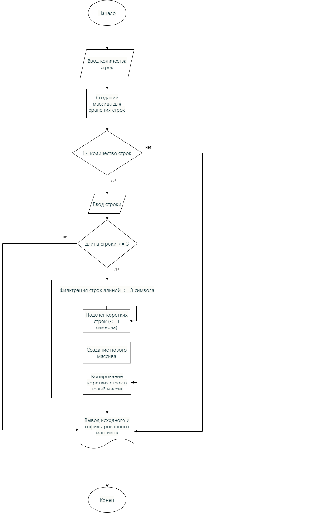

# String Filter

Задача: Написать программу, которая из имеющегося массива строк формирует новый массив из строк, длина которых меньше, либо равна 3 символам. Первоначальный массив можно ввести с клавиатуры, либо задать на старте выполнения алгоритма. При решении не рекомендуется пользоваться коллекциями, лучше обойтись исключительно массивами.

Примеры:
[“Hello”, “2”, “world”, “:-)”] → [“2”, “:-)”]
[“1234”, “1567”, “-2”, “computer science”] → [“-2”]
[“Russia”, “Denmark”, “Kazan”] → []

## Как использовать

1. Запустите программу.
2. Введите количество строк, которые вы хотите ввести.
3. Введите каждую строку по очереди.
4. Программа выведет исходный массив строк, а затем новый массив, содержащий только короткие строки (длиной 3 символа или меньше).

## Как работает программа

1. Пользователь вводит количество строк, которые он хочет ввести.
2. Программа создает массив для хранения этих строк.
3. Пользователь вводит каждую строку по очереди, и они сохраняются в массиве.
4. Программа фильтрует массив, оставляя только те строки, длина которых меньше или равна 3 символам.
5. Программа выводит исходный массив строк и отфильтрованный массив.

## Требования

Эта программа написана на C# и требует установленной среды .NET для запуска.

## Алгоритм программы

